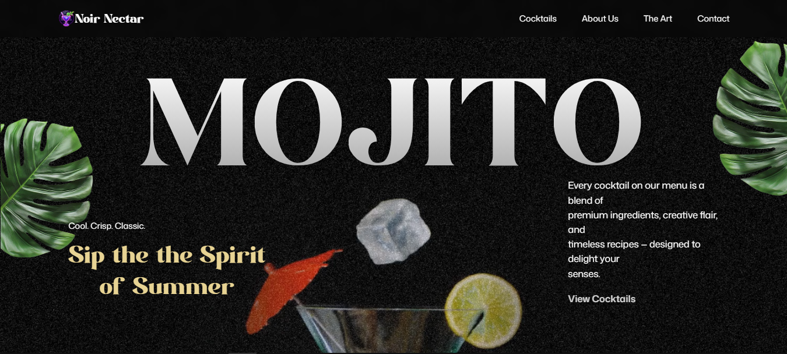
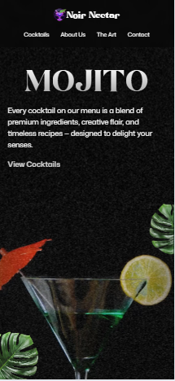
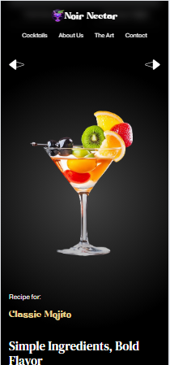
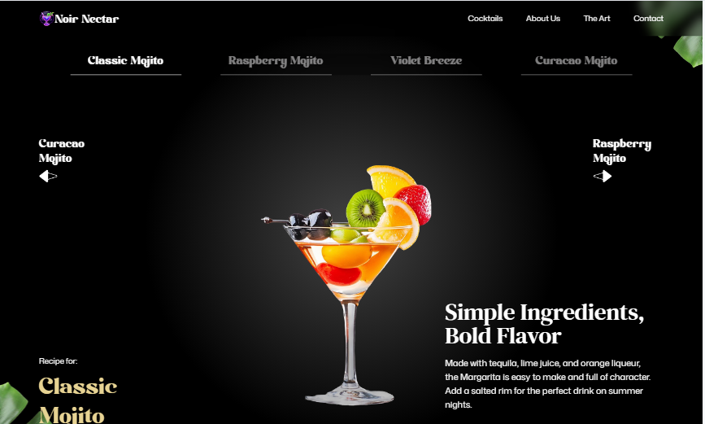

# 🍹 Mojito

An immersive cocktail landing page built with **React**, **Vite**, **GSAP**, and **Tailwind CSS**. The project combines modern UI design with scroll-driven animations to create an engaging and interactive browsing experience. From animated text reveals to a scroll-scrubbed hero video and dynamic cocktail showcase, every section is designed to demonstrate advanced frontend animation techniques.

## 🌐 Live Demo

**Website:** https://noir-nectar.pages.dev/

## 📂 Repository

**GitHub:** https://github.com/BuzzAlvin/noir-nectar#

---

## ✨ Features

* Animated hero section with character-by-character text reveal
* Scroll-scrubbed hero video using GSAP and ScrollTrigger
* Parallax leaf animations
* Interactive cocktail carousel with previous/next navigation
* Scroll-driven image masking animation
* Animated content reveals across multiple sections
* Responsive layout optimized for desktop and mobile devices
* Modern component-based architecture using React

---

## 🛠️ Tech Stack

* React
* Vite
* JavaScript (ES6+)
* GSAP

  * ScrollTrigger
  * SplitText
* Tailwind CSS
* React Responsive

---

## 📸 Screenshots

### Hero Section




### Cocktail Menu



---

## 🚀 Getting Started

### Clone the repository

```bash
git clone https://github.com/your-username/mojito.git
```

### Navigate to the project

```bash
cd mojito
```

### Install dependencies

```bash
npm install
```

### Start the development server

```bash
npm run dev
```

### Build for production

```bash
npm run build
```

---

## 🎨 Animations Implemented

### Hero

* SplitText character animation for the heading
* SplitText line animation for supporting text
* Scroll-based parallax leaf movement
* Scroll-scrubbed hero video with ScrollTrigger pinning

### Art Section

* Scroll-triggered image masking effect
* Progressive content reveal
* Smooth fade and scale transitions

### Cocktail Menu

* Animated cocktail image transitions
* Animated recipe information
* Interactive cocktail navigation
* Scroll-responsive decorative leaf animations

### Contact

* Word-by-word heading animation
* Staggered content reveal
* Animated decorative footer elements

---

## 📚 What I Learned

Building this project helped me strengthen my understanding of:

* Building complex animation timelines with GSAP
* Using ScrollTrigger for scroll-based interactions
* Implementing SplitText animations
* Managing interactive UI state in React
* Structuring scalable frontend projects

---

## 🙏 Acknowledgements

This project was built as part of a GSAP learning journey inspired by a frontend animation tutorial. While following the tutorial to understand the concepts, I recreated the project myself to practice advanced animation techniques and improve my GSAP and React development skills.

---

## 📄 License

This project is available under the MIT License.
